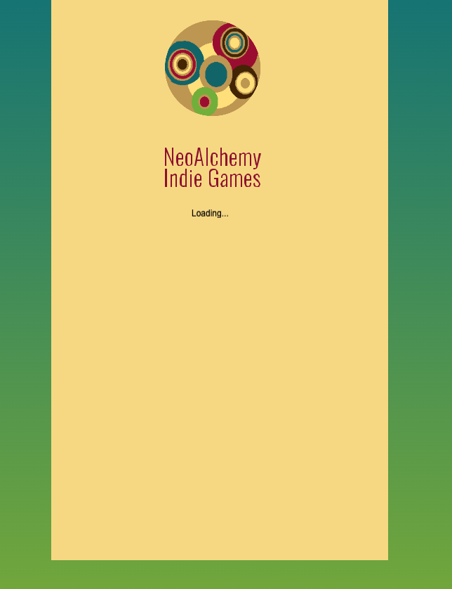

# Starting Boilerplate Phaser

This is my starting project template which is based on a Phaser 3 project template that uses the React framework and Vite for bundling. It includes a bridge for React to Phaser game communication, hot-reloading for quick development workflow and scripts to generate production-ready builds.  It also includes my default boot screen and preloading screen.

**[This Template Was Borrowed from Here.](https://github.com/phaserjs/template-react-ts)**

### Versions

This template has been updated for:

- [Phaser 3.85.2](https://github.com/phaserjs/phaser)
- [React 18.2.0](https://github.com/facebook/react)
- [Vite 5.3.1](https://github.com/vitejs/vite)
- [TypeScript 5.2.2](https://github.com/microsoft/TypeScript)

## Requirements

[Node.js](https://nodejs.org) is required to install dependencies and run scripts via `npm`.

## Available Commands

| Command | Description |
|---------|-------------|
| `npm install` | Install project dependencies |
| `npm run dev` | Launch a development web server |
| `npm run build` | Create a production build in the `dist` folder |
| `npm run dev-nolog` | Launch a development web server without sending anonymous data (see "About log.js" below) |
| `npm run build-nolog` | Create a production build in the `dist` folder without sending anonymous data (see "About log.js" below) |

